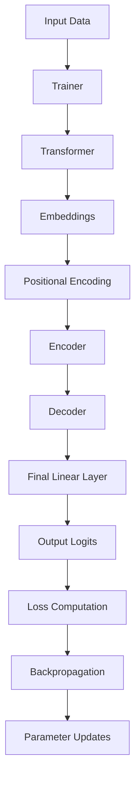

# Transformer Data Flow Documentation

## Overview
This document outlines the flow of data through the transformer implementation, from input to output, using dummy training data as an example.

## Data Flow Diagram


## Detailed Flow Description

### 1. Input Data Processing
- **Input**: Dummy training data (src_batch, tgt_batch)
- **Location**: `train.py` - `train_step` method
- **Process**:
  - Create padding masks using `create_padding_mask`
  - Create look-ahead masks using `create_look_ahead_mask`

### 2. Transformer Forward Pass
- **Location**: `transformer.py` - `__call__` method
- **Flow**:
  1. Source and target embeddings (`Embeddings` class)
  2. Positional encoding (`PositionalEncoding` class)
  3. Encoder processing (`Encoder` class)
  4. Decoder processing (`Decoder` class)
  5. Final linear projection

### 3. Loss Computation
- **Location**: `transformer.py` - `compute_loss` method
- **Process**:
  - Reshape logits and targets
  - Compute cross-entropy loss using `utils.cross_entropy`

### 4. Backpropagation
- **Location**: `train.py` - `step` method
- **Flow**:
  1. Compute gradients through model
  2. Update parameters using Adam optimizer
  3. Apply learning rate scheduling

## Component Details

### Embeddings Layer
- **File**: `embeddings.py`
- **Function**: Converts input tokens to dense vectors
- **Output Shape**: [batch_size, sequence_length, d_model]

### Encoder
- **File**: `encoder.py`
- **Components**:
  - Multi-head attention
  - Feed-forward networks
  - Layer normalization
- **Output Shape**: [batch_size, src_len, d_model]

### Decoder
- **File**: `decoder.py`
- **Components**:
  - Masked multi-head attention
  - Encoder-decoder attention
  - Feed-forward networks
  - Layer normalization
- **Output Shape**: [batch_size, tgt_len, d_model]

### Loss Functions
- **File**: `utils.py`
- **Functions**:
  - `cross_entropy`: Computes loss between predictions and targets
  - `cross_entropy_grad`: Computes gradients for backpropagation

## Training Loop
1. **Data Preparation**:
   ```python
   src_mask = create_padding_mask(src_batch)
   tgt_mask = create_look_ahead_mask(tgt_batch.shape[1])
   ```

2. **Forward Pass**:
   ```python
   predictions = model(src_batch, tgt_batch[:, :-1], src_mask, tgt_mask)
   ```

3. **Loss Computation**:
   ```python
   loss = compute_loss(predictions, tgt_batch[:, 1:])
   ```

4. **Backward Pass**:
   ```python
   model.backward(loss)
   ```

5. **Parameter Updates**:
   ```python
   optimizer.update(params, grads)
   ```

## Utility Functions
- **File**: `utils.py`
- **Key Functions**:
  - `softmax`: Numerical stable softmax computation
  - `gelu`: GELU activation function
  - `create_padding_mask`: Creates attention masks
  - `create_look_ahead_mask`: Creates decoder attention masks

## Configuration
- **File**: `config.py`
- **Parameters**:
  - Model dimensions
  - Number of layers
  - Vocabulary size
  - Learning rate
  - Training parameters

This documentation provides a comprehensive overview of how data flows through the transformer implementation, from input processing to final output generation and training. 